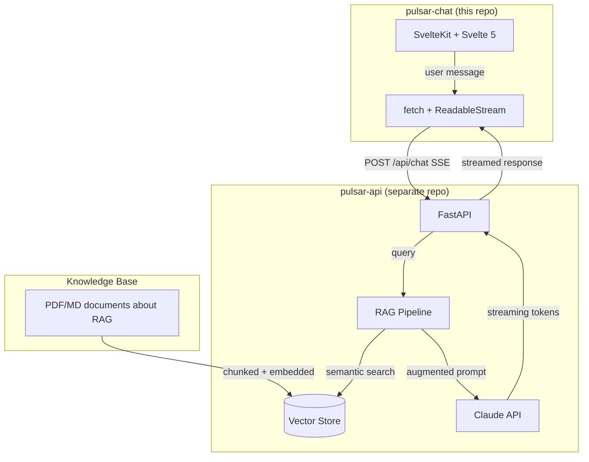
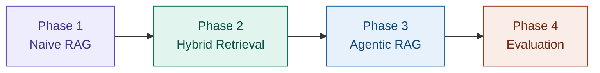
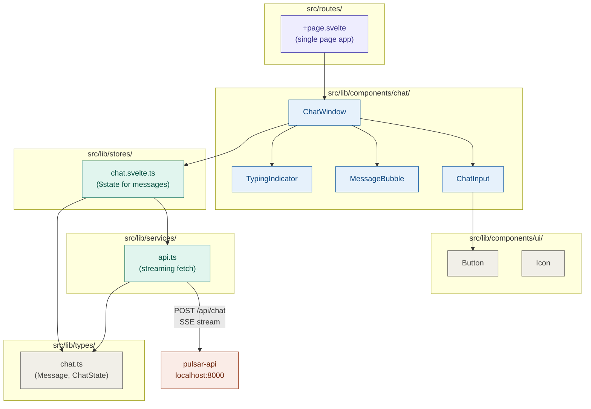
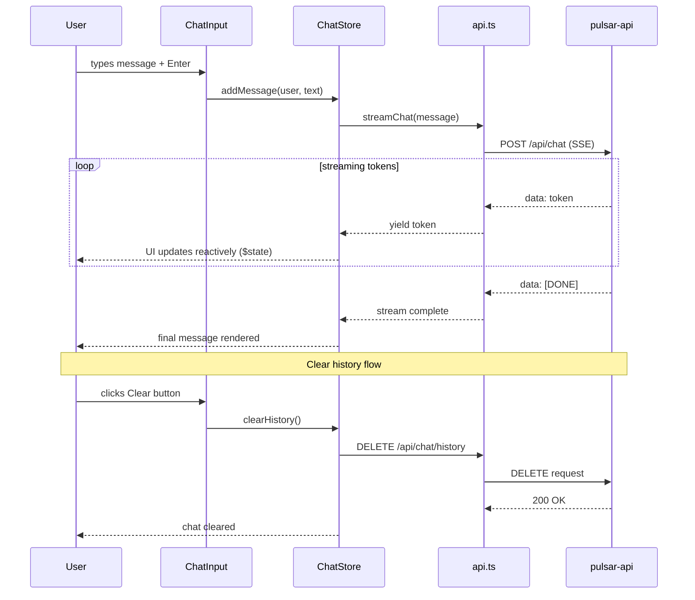
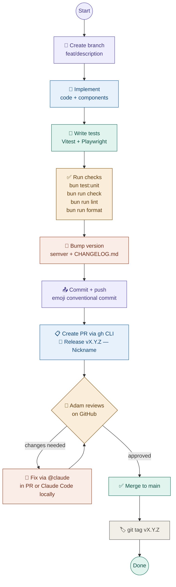

# Architecture & Vision

> This document captures the big picture — why this project exists, how the pieces fit together,
> and the reasoning behind every major decision. Claude Code should read this when working on
> anything that touches architecture, cross-repo concerns, or when it needs to understand the "why"
> behind a technical choice.

## Why This Project Exists

Pulsar is a **learning project** with three parallel goals:

1. **Learn RAG end-to-end** — not by reading tutorials, but by building a complete retrieval-augmented generation system from scratch. Chunking, embeddings, vector stores, retrieval strategies, re-ranking, evaluation — the full pipeline.

2. **Learn Svelte 5 & modern frontend** — coming from a Python/backend background (FastAPI, AWS, distributed systems), this is an opportunity to build real frontend skills with the latest tools: SvelteKit, Svelte 5 runes, Tailwind CSS 4, Bun.

3. **Learn Anthropic tooling** — Claude Code, Claude Chat, Cowork, CLAUDE.md, skills, MCP integrations. Use the tools to build the project, and learn the tools by building the project.

The meta-strategy: **the RAG knowledge base will contain documents about RAG itself**. We learn RAG by asking our RAG system questions about RAG. When retrieval fails, we immediately understand why — because we know the source material.

## System Overview

The project is split into two repositories that work together:



| Repo            | Purpose                          | Stack                                                                   |
| --------------- | -------------------------------- | ----------------------------------------------------------------------- |
| **pulsar-chat** | Chat UI with streaming           | SvelteKit, Svelte 5, Tailwind 4, Bun, TypeScript                        |
| **pulsar-api**  | RAG pipeline + LLM orchestration | Python, FastAPI, LlamaIndex/LangChain, ChromaDB → Qdrant, Anthropic SDK |

### Why Two Repos?

- Different languages (TypeScript vs Python) with different toolchains, linters, and test runners
- Independent deployment — frontend is a static build, backend is a Python service
- Clean separation of concerns — frontend knows nothing about RAG internals
- Both are Dockerized — each repo ships its own image

## RAG Learning Phases

The project is designed to progress through increasingly sophisticated RAG approaches:



### Phase 1: Naive RAG (weeks 1-2)

- Load PDF/Markdown documents
- Fixed-size chunking (~512 tokens, 50 token overlap)
- Embedding via Voyage AI or sentence-transformers
- ChromaDB as vector store (zero-infra, Python-native)
- Claude API for generation
- Simple "retrieve top-k → stuff into prompt → generate" pipeline

### Phase 2: Hybrid Retrieval (weeks 3-4)

- Add BM25 lexical search alongside semantic search
- Two-stage retrieval: broad fetch (top-50) → cross-encoder re-ranking (top-5)
- Metadata filtering (source, date, category)
- Experiment with chunking strategies: semantic chunking, parent-child chunks

### Phase 3: Agentic RAG (weeks 5-6)

- LLM agent decides when and what to retrieve (tool-use pattern)
- Query reformulation — agent rewrites vague queries before searching
- Multi-step retrieval loops with validation
- LangGraph for stateful agent workflows

### Phase 4: Evaluation (ongoing)

- RAGAs framework — faithfulness, answer relevancy, context precision
- Build eval dataset from the knowledge base
- Automated regression testing for retrieval quality
- A/B testing different retrieval strategies

### Dataset

The knowledge base consists of **documents about RAG itself**:

- Research papers (Lewis et al. 2020 original RAG paper, etc.)
- Framework documentation (LlamaIndex, LangChain)
- Blog posts and tutorials about RAG patterns
- Evaluation methodology papers

This creates a recursive learning loop — when the RAG system fails to answer a question about RAG, we immediately understand what went wrong because we know the source material.

## Technology Decisions

### Why Bun (not pnpm/npm)?

- Learning project = perfect time to experiment with cutting-edge tools
- Bun is a complete runtime + package manager + bundler + test runner in one
- 10-30x faster installs than npm, native TypeScript execution
- Used in production by Anthropic (Claude Code itself runs on Bun)
- `bun install` is local to `./node_modules` — no virtualenv equivalent needed in JS

### Why SvelteKit + Svelte 5 Runes?

- SvelteKit is the production standard for Svelte apps (routing, SSR, API routes)
- Svelte 5 runes (`$state`, `$derived`, `$effect`) are the new reactivity model — the old `$:` syntax is deprecated
- Compiler-first approach = smaller bundles, faster runtime than React/Vue
- Learning the current standard, not legacy patterns

### Why Tailwind CSS 4?

- De facto standard for utility-first styling
- No context-switching between component files and CSS files
- Excellent DX with IDE autocomplete

### Why FastAPI + Python for the backend?

- Strong existing Python expertise (years of FastAPI, AWS, distributed systems)
- The entire RAG/ML ecosystem is Python-native (LlamaIndex, LangChain, ChromaDB, sentence-transformers)
- FastAPI's native streaming response support (StreamingResponse + SSE)

### Why Docker?

- Reproducible environments across dev machines
- Foundation for future CI/CD pipeline
- Production-like setup from day one

## Pulsar Chat Architecture

### Component Structure



### Data Flow



### State Management

No global store library. State lives in a single rune-based module:

```typescript
// src/lib/stores/chat.svelte.ts
class ChatState {
	messages = $state<Message[]>([]);
	isStreaming = $state(false);
	error = $state<string | null>(null);

	messageCount = $derived(this.messages.length);
	hasMessages = $derived(this.messages.length > 0);
}

export const chatState = new ChatState();
```

Components import and use it directly — Svelte 5's fine-grained reactivity handles re-renders.

## Development Workflow

### Feature Lifecycle



### Roles

| Step                                                      | Who                                                 | Tool                       |
| --------------------------------------------------------- | --------------------------------------------------- | -------------------------- |
| Branch, implement, test, check, version, commit, push, PR | Claude Code                                         | Terminal / WebStorm plugin |
| Code review                                               | Adam                                                | GitHub PR interface        |
| Fix review comments                                       | Claude (via `@claude` in PR) or Claude Code locally | GitHub App / Terminal      |
| Approve + merge + tag                                     | Adam                                                | GitHub                     |

### PR Review with @claude on GitHub

When Adam leaves review comments on a PR, he can tag `@claude` directly in the comment.
The Claude GitHub App will read the feedback, make the fix, and push a commit to the PR branch automatically.
This avoids switching back to the terminal for minor fixes.

For larger changes, Adam returns to Claude Code locally, reads the review with `gh pr view --comments`,
and works through the feedback interactively.

## API Contract

### Endpoints (pulsar-api)

| Method | Path                | Description                         | Request                   | Response                                             |
| ------ | ------------------- | ----------------------------------- | ------------------------- | ---------------------------------------------------- |
| POST   | `/api/chat`         | Send message, get streamed response | `{ "message": "string" }` | SSE stream: `data: token\n\n` ... `data: [DONE]\n\n` |
| DELETE | `/api/chat/history` | Clear conversation history          | —                         | `{ "status": "ok" }`                                 |
| GET    | `/api/health`       | Health check                        | —                         | `{ "status": "ok" }`                                 |

### SSE Stream Format

```
data: Hello
data:  there
data: ,
data:  how
data:  can
data:  I
data:  help
data: ?
data: [DONE]
```

Each `data:` line contains one or more tokens. The frontend reads these via `ReadableStream` and
appends them to the current assistant message in real-time.

## Frontend Roadmap

Concrete next steps, broken into phases. Claude Code: pick these up in order.

### Phase 1: Quality & Foundation

The scaffold is solid but untested. Before anything else:

- **Unit tests (Vitest)** — `chat.svelte.ts` store (sendMessage, stopStreaming, clearChat), `api.ts` streaming parser, utility functions
- **E2E tests (Playwright)** — basic send flow, stop streaming, clear history, error state
- **Wire `Button` component** — `ChatInput` uses inline button markup; replace with the existing `Button.svelte` component for consistency
- **Create `Icon` component** — planned in the component diagram, never built; wrap SVG icons so they're not scattered inline

### Phase 2: Connection Awareness

The app is silent when the backend is down until the first message fails:

- **Health check indicator** — poll `GET /api/health` on mount; show a subtle status dot in the header (green = connected, red = offline)
- **Retry on error** — after a failed send, show a retry button on the failed message instead of just an error banner
- **Better error messages** — distinguish network errors from API errors in the UI copy

### Phase 3: UX Polish

Quality-of-life improvements once the core is solid:

- **Message timestamps** — `Message.createdAt` is already stored; surface it in `MessageBubble` as a subtle relative time ("just now", "2 min ago")
- **Copy message button** — hover action on assistant bubbles to copy raw markdown to clipboard
- **Auto-focus input** — refocus the textarea after clearing chat or stopping generation

### Phase 4: Multiple Conversations _(explicitly deferred)_

Currently a single in-memory thread. If this ever needs persistence:

- Conversation list / sidebar
- Named conversations with timestamps
- Requires backend changes (persistent storage, conversation IDs)

---

## Future Considerations

Things we explicitly decided NOT to do yet, and may never need:

- **CI/CD** — no pipeline yet. Docker images are built locally. Will set up GitHub Actions when there's a deployment target.
- **Authentication** — not needed for a local learning project. If this ever goes beyond localhost, add it.
- **Database** — the backend doesn't need persistent storage. Chat history lives in memory (Python dict). Clear endpoint resets it.
- **Deployment** — no hosting planned. Everything runs on localhost via Docker.
